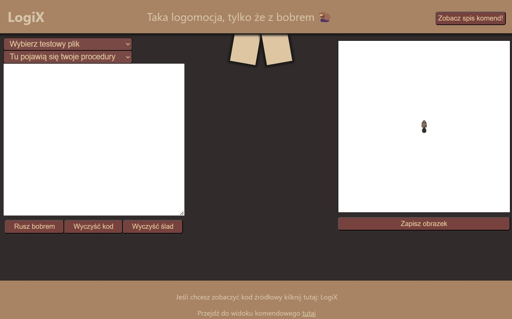
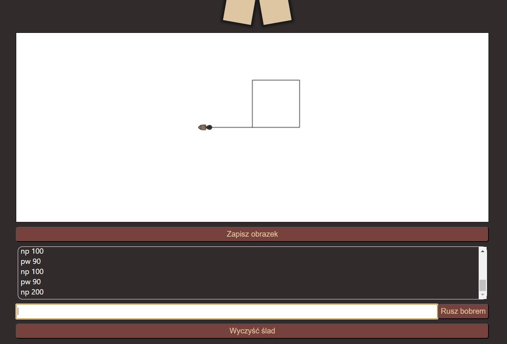
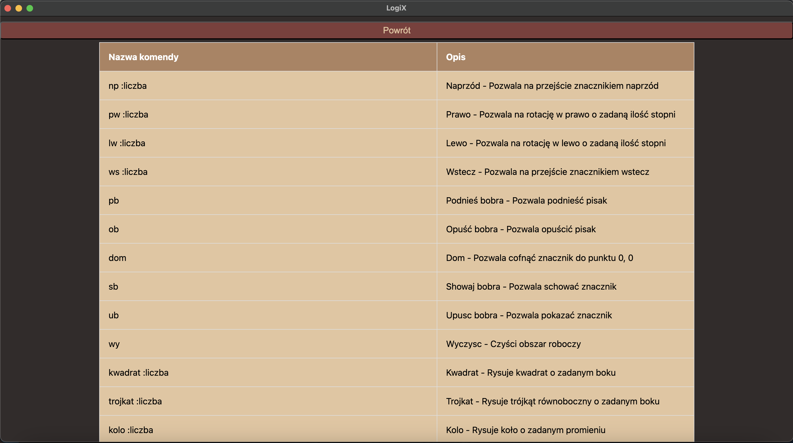

# LogiX

Interpreter do zmodyfikowanego języka [Logo](https://el.media.mit.edu/logo-foundation/what_is_logo/logo_programming.html) z graficznym interfejsem w electronJS. Wszystkie polecenia zostały zamienione na język Polski.
  - [Gramatyka](https://github.com/bwozniczka/LogiX-kompilatory/blob/main/src/grammar/LogiX.g4)
  - [Tokeny](https://github.com/bwozniczka/LogiX-kompilatory/blob/main/src/grammar/LogiXLexer.tokens)

## Informacja o stosowanych generatorach skanerów/parserów, pakietach zewnętrznych:
  - generator parserów: ANTLR
  - język implementacji: JavaScript
  - rodzaj translatora: interpreter 

### Co jest zaimplementowane

|Polecenie|Opis|
|---------|----|
|np :liczba|Pozwala na przejście znacznikiem naprzód|
|pw :liczba|Pozwala na rotację w prawo o zadaną ilość stopni|
|lw :liczba|Pozwala na rotację w lewo o zadaną ilość stopni|
|ws :liczba|Pozwala na przejście znacznikiem wstecz|
|pb|Pozwala podnieść pisak|
|ob|Pozwala opuścić pisak|
|dom|Pozwala cofnąć znacznik do punktu 0, 0|
|sb|Pozwala schować znacznik|
|ub|Pozwala pokazać znacznik|
|wy|Czyści obszar roboczy|
|kwadrat :liczba|Rysuje kwadrat o zadanym boku|
|trojkat :liczba|Rysuje trójkąt równoboczny o zadanym boku|
|kolo :liczba|Rysuje koło o zadanym promieniu|
|ustaw :liczba :liczba| Ustawia znacznik na zadanych współrzędnych (X,Y)
|napis :LITERAL_WYRAZU| Rysuje zadany teskt na ekranie
|powtorz: 'powtorz' liczba blok| Powtarza zadane wyrażenie
|deklaracjaProcedury: 'to' nazwa deklaracjeParametrow* EOL? (linia? EOL)+ 'end'| Pozwala zadeklarować procedure
|Jesli: 'jesli' porownanie blok| Funkcja warunkowa|
|wypisz: 'wypisz' wartosc|Wypisuje wartość liczbową, tekstową lub zwrot z funkcji|
|losowo: 'losowo' liczba|Zwraca losową liczbę z zakresu 0 - liczba|
|pierwszy: 'pierwszy' lista|Zwraca pierwszy element z listy|
|głowa: 'glowa' lista|Zwraca wszystkie elementy z listy poza ostatnim|
|ogon: 'ogon' lista|Zwraca wszystkie elementy z lsity poza pierwszym|
|ostatni: 'ostatni' lista|Zwraca ostatni element z listy|
|element: 'element' indeks lista|Zwraca element listy z podanego indeksu|
|elementWielowymiaru: 'elementww' lista listawielowymiarowa|Zwraca element z listy wielowymiarowej|
|wybierz: 'wybierz' lista|Zwraca losowo wybrany element z listy|
|usuń: 'usun' element lista|Zwraca listę bez podanego elementu|
|unikalna: 'unikalna' lista|Zwraca podaną listę bez duplikatów|

Poza tym mamy 10 testowych wiązanek zaimplementowanych metod gotowych do wklejenia oraz możliwość zapisania gotowego rysunku.

### Jak to wygląda?





### Jak to uruchomić?

```sh
npm i
npm start
```

W razie błędu, może być jeszcze potrzeba usunąć package-lock.json i node_modules aby zainstalować paczki ponownie.

Dobrej zabawy :D
