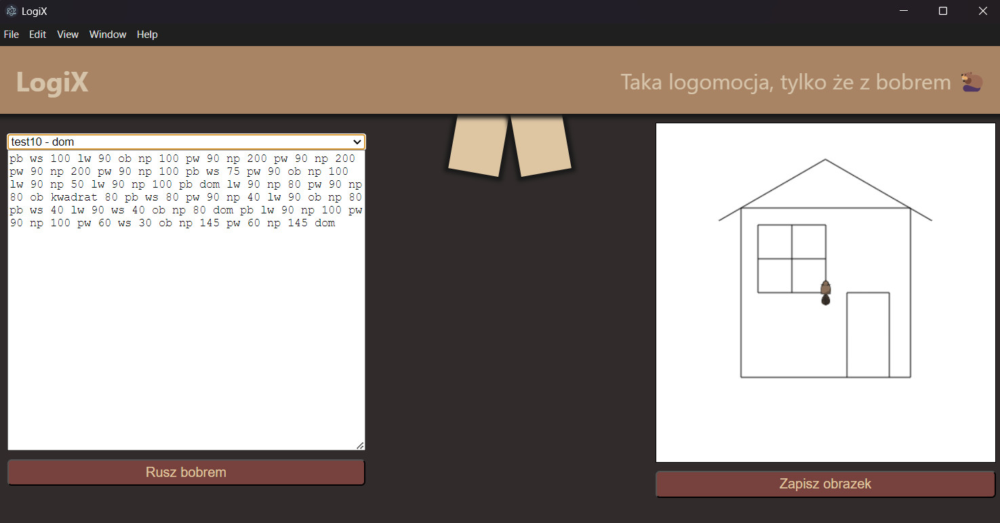

# LogiX

Interpreter do zmodyfikowanego logo z graficznym interfejsem w electronJS.

### Co jest zaimplementowane

|Polecenie|Opis|
|---------|----|
|np :liczba|Pozwala na przejście znacznikiem naprzód|
|pw :liczba|Pozwala na rotację w prawo o zadaną ilość stopni|
|lw :liczba|Pozwala na rotację w lewo o zadaną ilość stopni|
|ws :liczba|Pozwala na przejście znacznikiem wstecz|
|pb|Pozwala podnieść pisak|
|ob|Pozwala opuścić pisak|
|dom|Pozwala cofnąć znacznik do punktu 0, 0|
|sb|Pozwala schować znacznik|
|ub|Pozwala pokazać znacznik|
|wy|Czyści obszar roboczy|
|kwadrat :liczba|Rysuje kwadrat o zadanym boku|

### Jak to wygląda?



### Jak to uruchomić?

```sh
npm i
npm start
```

Może być jeszcze potrzeba u

Dobrej zabawy :D