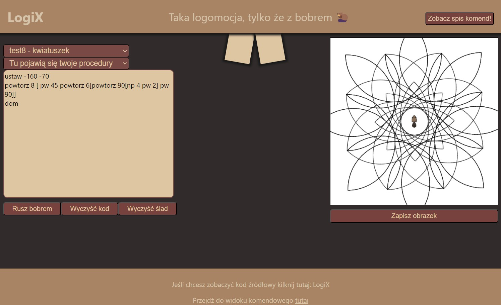

# LogiX

Interpreter do zmodyfikowanego logo z graficznym interfejsem w electronJS.
## Informacja o stosowanych generatorach skanerów/parserów, pakietach zewnętrznych:
  - generator parserów: ANTLR
  - język implementacji: JavaScript
  - rodzaj translatora: interpreter 

### Co jest zaimplementowane

|Polecenie|Opis|
|---------|----|
|np :liczba|Pozwala na przejście znacznikiem naprzód|
|pw :liczba|Pozwala na rotację w prawo o zadaną ilość stopni|
|lw :liczba|Pozwala na rotację w lewo o zadaną ilość stopni|
|ws :liczba|Pozwala na przejście znacznikiem wstecz|
|pb|Pozwala podnieść pisak|
|ob|Pozwala opuścić pisak|
|dom|Pozwala cofnąć znacznik do punktu 0, 0|
|sb|Pozwala schować znacznik|
|ub|Pozwala pokazać znacznik|
|wy|Czyści obszar roboczy|
|kwadrat :liczba|Rysuje kwadrat o zadanym boku|
|trojkat :liczba|Rysuje trójkąt równoboczny o zadanym boku|
|kolo :liczba|Rysuje koło o zadanym promieniu|
|ustaw :liczba :liczba| Ustawia znacznik na zadanych współrzędnych (X,Y)
|napis :LITERAL_WYRAZU| Rysuje zadany teskt na ekranie
|powtorz: 'powtorz' liczba blok| Powtarza zadane wyrażenie
|deklaracjaProcedury: 'to' nazwa deklaracjeParametrow* EOL? (linia? EOL)+ 'end'| Pozwala zadeklarować procedure
|Jesli: 'jesli' porownanie blok| Funkcja warunkowa|

Poza tym mamy 10 testowych wiązanek zaimplementowanych metod gotowych do wklejenia oraz możliwość zapisania gotowego rysunku.

### Jak to wygląda?




### Jak to uruchomić?

```sh
npm i
npm start
```

W razie błędu, może być jeszcze potrzeba usunąć package-lock.json i node_modules aby zainstalować paczki ponownie.

Dobrej zabawy :D
